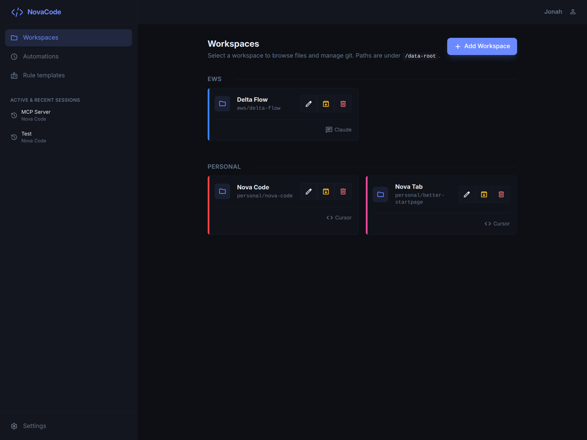
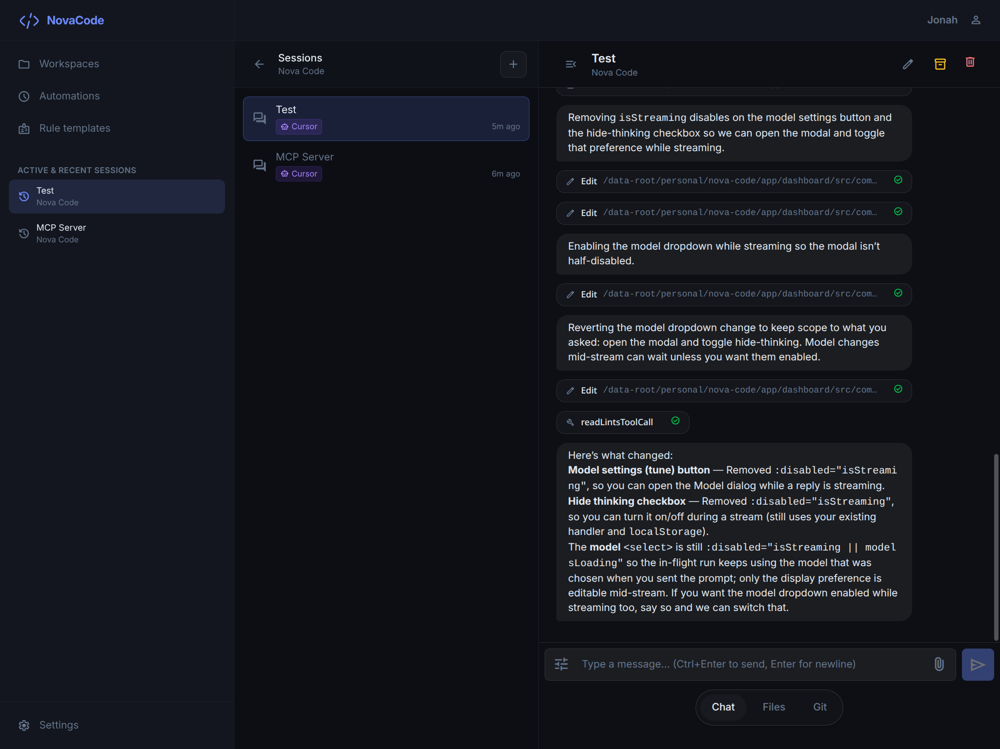

<div align="center">

# NovaCode

**Self-hosted dashboard for AI coding agents**

Run [Cursor Agent](https://cursor.com) and [Claude Code](https://claude.ai/code) against your own repos through a clean web UI — no cloud, no lock-in.

[](LICENSE)
[](https://nodejs.org)
[](https://vuejs.org)
[](https://postgresql.org)

</div>

---

<p align="center">
  
  <br><em>Workspace overview — all your projects and sessions at a glance</em>
</p>

<p align="center">
  
  <br><em>Session view — streaming chat alongside a live terminal</em>
</p>

> **Screenshots are placeholders.** Replace the images in `docs/screenshots/` with real ones before publishing.

---

## Features

| | |
|---|---|
| **Workspaces** | Map any directory on your host to a named project. Group, color-code, tag, and archive. |
| **Sessions** | Start a Cursor Agent or Claude Code session per workspace. Streaming chat over WebSocket, image attachments, tags, archive. |
| **Terminal** | Full PTY-backed terminal output via `node-pty` and xterm.js. |
| **Automations** | Schedule recurring agent prompts per workspace (cron-style intervals). |
| **Git** | Per-workspace Git status, diffs, and multi-repo discovery — right in the UI. |
| **File browser** | Browse and read/write files inside a workspace without leaving the app. |
| **Workspace rules** | Markdown rule files injected into every agent prompt for that workspace. |
| **Role templates** | Reusable instruction snippets for bootstrapping new rule files. |
| **API tokens** | Generate static tokens for programmatic or CI/CD access. |
| **Web Push** | Browser notifications when sessions produce output; VAPID keys are created automatically in the config volume. |
| **Health endpoint** | `GET /api/health` — unauthenticated, ready for Docker `HEALTHCHECK` and uptime monitors. |

---

## Requirements

- **Docker + Docker Compose** (recommended) — or Node.js 24 + PostgreSQL 17 for a manual install
- **Cursor Agent** and/or **Claude Code** CLI — installed and authenticated on the host (see [Agent setup](#agent-setup))
- Directories you want to work on must appear under `/data-root` in the container (with the stock compose, that is everything under `~/.novacode/data` on the host, or extra bind mounts you add)

---

## Quick start

### One-line installer (`install.sh`)

For a **published Docker image** under `~/.novacode` (install and updates use the same command):

```bash
curl -fsSL https://raw.githubusercontent.com/JonahFintzDev/novacode/main/scripts/install.sh | bash
```

**Prerequisites:** Docker with Compose (`docker compose` or `docker-compose`), and `openssl` on first install.

The script writes `~/.novacode/.env` with generated secrets, pulls `novacode/novacode:latest`, and starts Compose. Re-run the same command to update. Optional environment variables:

| Variable | Purpose |
|----------|---------|
| `NOVACODE_DIR` | Install root (default: `~/.novacode`) |
| `NOVACODE_INSTALL_BASE_URL` | Raw URL of the repo root for fetched compose and `.env.example` (see `scripts/install.sh`) |
| `NOVACODE_IMAGE` | Image tag (default: `novacode/novacode:latest`) |

On first install you may be prompted for extra host directory mounts (workspaces under `/data-root/...`). Then open **`http://localhost:3030`** and complete **first-run setup**.

### Docker Compose (build from source)

```bash
# 1. Clone the application repository
git clone https://github.com/JonahFintzDev/novacode.git
cd novacode

# 2. Create your env file
cp .env.example .env
#    → Edit .env: set POSTGRES_PASSWORD, JWT_SECRET, and your UID/GID

# 3. By default, ~/.novacode/data on the host is mounted at /data-root — put repos there
#    (mkdir -p ~/.novacode/data) or edit docker-compose.yml to add more bind mounts.

# 4. Build and start
export UID=$(id -u) GID=$(id -g)
docker compose up --build -d

# 5. Open the app and complete first-run setup
#    http://localhost:3030  (or whatever PORT you set)
```

> [!TIP]
> On first launch the app shows a **setup screen** — create your admin account there. No pre-seeding required.

> [!NOTE]
> The `novacode` container needs the Cursor Agent and Claude Code CLIs available. They are installed during the Docker build. Log in to each agent from **Settings → Agent Auth** inside the app.

---

## Configuration

Copy `.env.example` to `.env` and edit the values below.

### Required

| Variable | Description |
|----------|-------------|
| `POSTGRES_PASSWORD` | Password for the PostgreSQL user |
| `JWT_SECRET` | Long random string for signing JWTs — `openssl rand -hex 32` |

### PostgreSQL

| Variable | Default | Description |
|----------|---------|-------------|
| `POSTGRES_USER` | `postgres` | Database user |
| `POSTGRES_DB` | `novacode` | Database name |
| `POSTGRES_HOST` | `postgres` | Hostname — use `postgres` in Docker Compose, or your external DB host |
| `POSTGRES_PORT` | `5432` | Port |
| `DATABASE_URL` | *(unset)* | Optional full connection URL — overrides all `POSTGRES_*` vars when set |

### Server

| Variable | Default | Description |
|----------|---------|-------------|
| `PORT` | `3030` | HTTP port the API listens on |
| `UID` / `GID` | `1000` | Host user/group for files written inside the container |

### Optional

| Variable | Description |
|----------|-------------|
| `AGENT_ENV_*` | Any env var prefixed with `AGENT_ENV_` is forwarded to spawned agents with the prefix stripped |

---

## Agent setup

NovaCode spawns **Cursor Agent** and **Claude Code** as child processes inside the container. Both CLIs are installed during the Docker build. After starting the app:

1. Go to **Settings → Agent Auth**
2. Log in to Cursor and/or Claude — the app opens an interactive terminal session for the auth flow
3. Credentials are stored under `/config` (by default `~/.novacode/config` on the host via the stock compose file) and persist across restarts

---

## Volume mounts

The API resolves workspace paths relative to `/data-root` inside the container.

The stock `docker-compose.yml` maps one host tree to `/data-root` and keeps app state on the host:

- `~/.novacode/config` → `/config` (app state, agent credentials)
- `~/.novacode/data` → `/data-root` (your projects — workspace paths in the app are relative to this directory)

Put repositories under `~/.novacode/data` on the host (for example `~/.novacode/data/acme-app`), then create a workspace in the app with path `acme-app`.

If you prefer several host locations instead of one tree, add more lines under `novacode.volumes`, for example:

```yaml
volumes:
  - ~/.novacode/config:/config
  - /home/yourname/projects:/data-root/projects
  - /home/yourname/work:/data-root/work
```

Then use workspace paths like `projects/my-repo` or `work/client-site`.

### Git push over SSH

The API generates an **ed25519** SSH keypair on startup (under `/config/.ssh/` on the config volume) if it is not already present, and configures Git to use it for SSH remotes. To push from the UI or agents:

1. Open **Settings → Git** and copy the **public** key into your Git host (GitHub, GitLab, Gitea, etc.).
2. Ensure the remote uses an **SSH** URL (for example `git@github.com:org/repo.git`). HTTPS remotes use the host’s credential helper, not this key.

The same screen lists the **private** key for advanced setups (treat it as a secret). Keys persist in `~/.novacode/config/.ssh/` on the host with the stock compose file.

---

## Development

### API

```bash
cd api
npm ci
# Copy and fill in env vars
cp ../.env.example .env
npx prisma migrate dev
npm run dev          # starts on PORT (default 3000 locally)
```

### Dashboard

```bash
cd dashboard
npm ci
# Point Vite at your local API
VITE_API_URL=http://localhost:3000/api npm run dev
```

### Docker (split services)

```bash
cp .env.example .env   # edit as needed
export UID=$(id -u) GID=$(id -g)
docker compose -f dev.docker-compose.yaml up --build
# API  → http://localhost:21000
# Dashboard → http://localhost:21001
```

### Database migrations

```bash
# Interactive helper (prompts for migration name)
./migrate-dev.sh

# Or directly
cd api && npx prisma migrate dev --name your_migration_name
```

---

## Project structure

This README is the **application** package. In the full repository, these paths sit under `app/`.

```
app/
├── api/                  # Fastify backend (TypeScript)
│   ├── src/
│   │   ├── classes/      # DB, auth, config, PTY, chat engine, …
│   │   └── routes/       # REST + WebSocket route handlers
│   └── prisma/           # Schema + migrations
├── dashboard/            # Vue 3 frontend (Vite + Tailwind)
│   └── src/
│       ├── views/        # Page-level components
│       ├── components/   # Shared UI components
│       └── stores/       # Pinia stores
├── docs/                 # Additional documentation
├── scripts/
│   ├── install.sh        # One-line Docker install / update
│   └── docker-compose.install.yml
├── docker-compose.yml    # Production compose (build from Dockerfile)
├── dev.docker-compose.yaml
└── Dockerfile
```

---

## Tech stack

| Layer | Technology |
|-------|-----------|
| API | [Fastify](https://fastify.dev) · TypeScript · [Prisma](https://prisma.io) · PostgreSQL |
| Real-time | WebSocket (`@fastify/websocket`) |
| Terminal | [node-pty](https://github.com/microsoft/node-pty) · [xterm.js](https://xtermjs.org) |
| Frontend | [Vue 3](https://vuejs.org) · [Pinia](https://pinia.vuejs.org) · [Tailwind CSS v4](https://tailwindcss.com) |
| Agents | Cursor Agent CLI · Claude Code CLI |

---

## Contributing

Pull requests are welcome. For larger changes, please open an issue first to discuss what you'd like to change.

---

## License

[MIT](LICENSE) © Jonah Fintz
